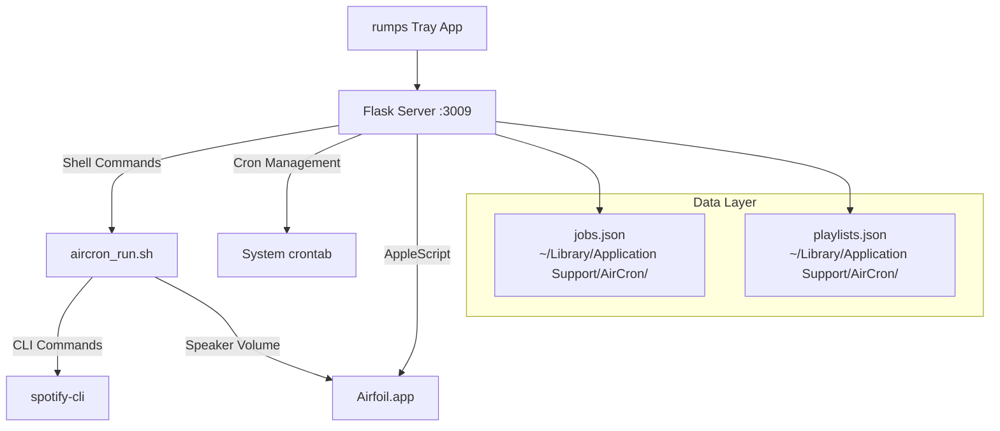

# AirCron UI

> **Professional Audio Scheduling for macOS**  
> A lightweight tray application that enables non-technical users to schedule Spotify and Airfoil audio actions across multiple speaker zones.

[](https://www.apple.com/macos/)
[](https://www.python.org/)
[](LICENSE)

---

## 🎯 Overview

AirCron UI replaces manual script editing and `crontab -e` with an intuitive web interface for scheduling audio automation. Perfect for hotels, restaurants, offices, or any environment requiring automated music management across multiple audio zones.

### ✨ Key Features

- **🔊 Multi-Zone Audio Control** - Schedule actions for individual speakers, custom groups, or all speakers simultaneously
- **🎵 Dual Volume Architecture** - Global Spotify volume control + individual Airfoil speaker volume management
- **📅 Visual Schedule Management** - 24-hour grid view with color-coded actions and drag-and-drop simplicity
- **🍃 Lightweight Tray App** - Runs silently in the menu bar, auto-launches browser interface
- **⚡ Real-Time Speaker Discovery** - Automatic detection of available Airfoil speakers via AppleScript
- **🔒 Sandboxed Cron Integration** - Safe cron management with isolated AirCron sections and automatic backups
- **📱 Responsive HTMX Interface** - Modern, fast UI that works seamlessly without complex JavaScript frameworks

---

## 🏗️ Architecture



### 🔧 Technology Stack

| Component            | Technology          | Purpose                                              |
| -------------------- | ------------------- | ---------------------------------------------------- |
| **Tray Application** | Python 3.12 + rumps | Menu bar interface, browser launcher                 |
| **Web Server**       | Flask + HTMX        | REST API + responsive UI                             |
| **Audio Control**    | AppleScript + Bash  | Airfoil integration + Spotify CLI                    |
| **Job Persistence**  | JSON Files          | Schedule storage in `~/Library/Application Support/` |
| **Cron Management**  | Python subprocess   | Safe crontab manipulation with backups               |
| **Frontend**         | Modular JavaScript  | Clean architecture across 5 focused modules          |

### 🏆 Recent Major Improvements

**✅ Complete JavaScript Refactoring (Dec 2024)**

- Transformed monolithic 858-line `app.js` into 5 focused modules (584 total lines)
- **notifications.js** (36 lines): Toast notification system
- **modal-manager.js** (349 lines): All modal operations and state management
- **schedule-view.js** (154 lines): 24-hour grid visualization and calendar
- **app-core.js** (27 lines): Core utilities and HTMX coordination
- **app.js** (18 lines): Main application coordinator

**✅ Critical Bug Fixes (Dec 2024)**

- Fixed infinite "Loading preview..." after first "Apply to Cron" use
- Resolved job vanishing issue (multiple pending jobs now supported)
- Fixed broken cancel button and missing detailed change previews
- Corrected schedule view display issues and day selector styling

**✅ Enhanced User Experience**

- 24-hour schedule view (00:00-23:59) instead of limited 6 AM-11 PM window
- Descriptive action text: "Play Playlist", "Volume → 45%", "Resume Playback"
- Color-coded job types with clear text labels for accessibility
- Improved modal state management and error handling

**✅ 2025-07-07 - Robust Cron Diff, UI Sync, and Edit Reliability**

- **Cron Review Modal Diff**: Jobs are now matched by unique ID, so edits show as 'changed' (with field-by-field diffs), not as add/remove pairs. No more swap confusion or spurious changes.
- **UI State Sync**: After applying cron changes, the UI always re-fetches all jobs and updates all views, so you never see stale or invisible jobs.
- **Reliable Job Editing**: Editing a job always updates the correct job, even if you change speakers/zones in the modal. No more silent discards.
- **Zone Refresh Robustness**: The UI always refreshes the correct zone and job list after any add/edit/apply, with fallback to reload if needed.

### 🆕 2025 Refactor: Service Modules & Bulletproof API

- All API endpoints are now thin wrappers; business logic is in `app/services/` modules:
  - `jobs_service.py`, `cron_service.py`, `speakers_service.py`, `playlists_service.py`
- API returns robust, conventional error codes:
  - `400` for bad input (missing/invalid fields, invalid time/days/action)
  - `404` for not found (update/delete non-existent job/playlist)
  - `409` for true conflicts (duplicate jobs/playlists)
- All file I/O is safe: `jobs.json` and `playlists.json` are always created if missing
- Test suite covers all edge cases, negative cases, and error codes
- No business logic remains in `api.py`—all validation, conflict, and file logic is in services

---

## 🚀 Quick Start

### Prerequisites

```bash
# Install Spotify CLI (choose one)
brew install kylef/formulae/spotify-cli  # Homebrew
# OR download from: https://github.com/kylef/spotify-cli

# Ensure Airfoil is installed
# Download from: https://www.rogueamoeba.com/airfoil/
```

### Installation

1. **Clone the repository:**

   ```bash
   git clone <repository-url>
   cd aircron
   ```

2. **Install Python dependencies:**

   ```bash
   python3.12 -m pip install -r requirements.txt
   ```

3. **Run in development mode:**

   ```bash
   python main.py
   ```

   - Tray icon appears in menu bar
   - Browser opens automatically to `http://127.0.0.1:3009`

4. **Build standalone app:**
   ```bash
   ./build.sh
   ```
   - Creates `dist/AirCron.app` (~35MB)
   - Drag to Applications folder

---

## 📱 User Interface

### 📅 Create Schedules Tab

The primary interface for schedule management:

- **Multi-Speaker Selection** - Check any combination of speakers
- **Flexible Zone Creation** - Individual speakers, "All Speakers", or custom groups
- **Smart Job Creation** - Required job labels for easy identification
- **Real-Time Status** - Live "Applied" vs "Pending Apply" indicators

### 📋 Active Cron Jobs Tab

View and manage all schedules currently active in cron:

- **Zone Organization** - Jobs grouped by speaker configuration
- **Direct Editing** - Edit/delete jobs without leaving the tab
- **Status Transparency** - Only shows jobs actually applied to system cron

### 🗓️ View Schedule Tab

Professional 24-hour schedule visualization:

- **Daily Grid View** - All jobs displayed in their correct time slots
- **Color-Coded Actions** - Green (play), Yellow (pause), Blue (resume), Purple (volume)
- **Speaker Tooltips** - Hover icons to see full speaker lists
- **Inline Management** - Edit/delete buttons for each scheduled item

### 🎵 Manage Playlists Tab

Centralized playlist library management:

- **URI Storage** - Save frequently used Spotify playlists, albums, and tracks
- **Smart Picker** - Dropdown selection in job creation (no more manual URI entry)
- **CRUD Operations** - Full create, read, update, delete functionality

---

## 🎛️ Audio Control Systems

### Dual Volume Architecture

AirCron implements sophisticated dual volume control:

#### 🔊 "All Speakers" Volume Control

- **Method:** Spotify master volume (`spotify vol X`)
- **Range:** 0-100
- **Effect:** Global volume change affecting all connected speakers equally
- **Use Case:** Synchronized volume adjustments across entire audio system

#### 📻 Individual/Custom Speaker Volume Control

- **Method:** Airfoil per-speaker volume via AppleScript
- **Range:** 0-100% (converted to 0.0-1.0 for Airfoil)
- **Effect:** Independent volume control per speaker
- **Use Case:** Zone-specific audio levels, complex routing scenarios

### 🎵 Action Types

| Action     | Description                        | Arguments                          |
| ---------- | ---------------------------------- | ---------------------------------- |
| **Play**   | Start playback of specific content | Spotify URI (playlist/album/track) |
| **Pause**  | Stop current playback              | None                               |
| **Resume** | Continue paused playback           | None                               |
| **Volume** | Adjust speaker volume              | Percentage (0-100)                 |

---

## 📁 File Structure

```
aircron/
├── main.py                    # 🚀 Tray app entry point
├── app/                       # 🏗️ Flask application package
│   ├── __init__.py           #    App factory and configuration
│   ├── api.py                #    REST API endpoints
│   ├── views.py              #    HTML routes for HTMX
│   ├── cronblock.py          #    Cron management with sandboxing
│   ├── speakers.py           #    Airfoil AppleScript integration
│   ├── jobs_store.py         #    JSON persistence layer
│   └── tests/                #    Test suite
├── templates/                # 🎨 Jinja2 templates
│   ├── base.html            #    Base layout
│   ├── index.html           #    Main application
│   └── partials/            #    HTMX component partials
├── static/                   # 📦 Modular JavaScript architecture
│   ├── app.js               #    Main coordinator (18 lines)
│   ├── app-core.js          #    Core utilities (27 lines)
│   ├── notifications.js     #    Toast system (36 lines)
│   ├── modal-manager.js     #    Modal operations (349 lines)
│   └── schedule-view.js     #    Schedule grid (154 lines)
├── aircron_run.sh           # 🔧 Shell wrapper for cron execution
├── requirements.txt         # 📋 Python dependencies
├── build.sh                 # 🏭 PyInstaller build script
└── README.md               # 📖 This file
```

---

## 🛠️ API Reference

### Core Endpoints

#### Speaker Management

```http
GET /api/speakers                 # Get available speakers
POST /api/speakers/refresh        # Force speaker discovery
```

#### Job Management

```http
GET /api/jobs/<zone>             # Get jobs for zone
POST /api/jobs/<zone>            # Create new job
PUT /api/jobs/<zone>/<id>        # Update existing job
DELETE /api/jobs/<zone>/<id>     # Delete job
GET /api/jobs/all                # Get all jobs (for schedule view)
```

#### Cron Operations

```http
POST /api/cron/apply             # Apply all jobs to crontab
GET /api/cron/status             # Get current cron application status
GET /api/cron/preview            # Preview changes before applying
GET /api/cron/jobs               # Get all currently applied jobs
```

#### Playlist Management

```http
GET /api/playlists               # Get all saved playlists
POST /api/playlists              # Create new playlist
PUT /api/playlists/<id>          # Update playlist
DELETE /api/playlists/<id>       # Delete playlist
```

### Job Object Structure

```json
{
  "id": "uuid4-string",
  "zone": "Kitchen", // or "All Speakers" or "Custom:Kitchen,Living Room"
  "label": "Morning Jazz",
  "days": [1, 2, 3, 4, 5], // 1=Monday, 7=Sunday
  "time": "07:30",
  "action": "play", // "play" | "pause" | "resume" | "volume"
  "args": {
    "uri": "spotify:playlist:...", // for play action
    "volume": 75 // for volume action
  }
}
```

---

## 🔒 Cron Integration

### Sandboxed Block Format

AirCron uses isolated cron sections for safe management:

```bash
# BEGIN AirCron (auto-generated; do not edit between markers)

# Kitchen – Morning Jazz 07:30
30 7 * * 1-5 /path/to/aircron_run.sh "Kitchen" play "spotify:playlist:..."

# All Speakers – Global Volume 09:30
30 9 * * 1-5 /path/to/aircron_run.sh "All Speakers" volume 75

# END AirCron
```

### Safety Features

- **🛡️ Isolated Sections** - Only content between markers is managed
- **📄 Automatic Backups** - Crontab backed up to `~/aircron_backup_YYYY-MM-DDTHHMMSS.txt`
- **✅ Validation** - Comprehensive cron syntax validation before application
- **🔄 Recovery** - Manual recovery possible from backup files if needed

### 🛡️ Cron Review Robustness

- The review modal only shows changes if the set of cron lines in jobs.json and the crontab differ, regardless of job IDs or field swaps.
- The backend diff logic is robust: it never shows phantom changes—only actionable changes that would actually affect the crontab.
- The UI always fetches the latest backend diff and never shows stale or cached data.

### API/Diff Note

- The backend now matches jobs by unique ID for all diff operations, ensuring only true changes are shown in the review modal.

---

## 📊 Logging & Monitoring

### Application Logs

- **Location:** `~/Library/Logs/AirCron/aircron.log`
- **Content:** Application startup, API requests, speaker discovery, errors
- **Rotation:** Automatic log rotation to prevent disk space issues

### Cron Execution Logs

- **Location:** `~/Library/Logs/AirCron/cron.log`
- **Content:** Detailed execution logs for all scheduled actions
- **Format:** Timestamped entries with command details and results

---

## 🏢 Production Deployment

### Build Process

```bash
./build.sh
```

Creates a self-contained macOS application:

- **Output:** `dist/AirCron.app`
- **Size:** ~35MB
- **Dependencies:** All Python dependencies bundled
- **Signing:** Automatic ad-hoc code signing for local deployment

### Auto-Launch Setup

For production environments, install the included launch agent:

```bash
cp dist/com.orchid.aircron.plist ~/Library/LaunchAgents/
launchctl load ~/Library/LaunchAgents/com.orchid.aircron.plist
```

### System Requirements

| Requirement      | Minimum              | Recommended        |
| ---------------- | -------------------- | ------------------ |
| **macOS**        | 10.13 High Sierra    | 10.15 Catalina+    |
| **Python**       | 3.12.0               | 3.12.3+            |
| **RAM**          | 256MB                | 512MB              |
| **Storage**      | 100MB                | 500MB              |
| **Dependencies** | spotify-cli, Airfoil | + cron permissions |

---

## 🧪 Development

### Running Tests

```bash
# Run test suite (now covers all edge cases and error codes)
pytest --cov=app --cov-fail-under=90
```

- All endpoints and error cases are tested: jobs, cron, speakers, playlists
- Edge cases: missing/invalid fields, invalid time/days/action, duplicate, not found, file creation
- API always returns correct HTTP status codes for all error types

### Development Server

```bash
python main.py
```

- Hot reload enabled in development
- Logs to console + file
- Browser auto-opens to `http://127.0.0.1:3009`

### Contributing

1. Follow PEP 8 style (enforced by `black` and `ruff`)
2. Add type hints for all functions
3. Update tests for new functionality
4. Use conventional commit messages
5. Ensure compatibility with macOS 10.13+

---

## 🔧 Troubleshooting

### Common Issues

#### "spotify-cli not found"

```bash
# Install via Homebrew
brew install kylef/formulae/spotify-cli

# Or check PATH
which spotify
```

#### "No speakers found"

- Ensure Airfoil is running
- Check speaker connections in Airfoil GUI
- Click "Refresh" button in AirCron interface

#### "Cron jobs not executing"

```bash
# Check cron logs
tail -f ~/Library/Logs/AirCron/cron.log

# Verify crontab entries
crontab -l | grep -A 20 "BEGIN AirCron"
```

#### "Port 3009 already in use"

The application automatically kills existing processes on port 3009 during startup.

### Debug Mode

Enable verbose logging by setting environment variable:

```bash
export AIRCRON_DEBUG=1
python main.py
```

### If you see 'Unknown' jobs in the review modal, it means there are orphaned cron lines not mapped to any job in jobs.json. These will be cleaned up on apply.

### If the UI ever seems out of sync, simply apply changes or reload—the system will always re-sync jobs.json and the crontab.

---

## 📝 License

This project is licensed under the MIT License - see the [LICENSE](LICENSE) file for details.

---

## 🙏 Acknowledgments

- **Rogue Amoeba** for Airfoil audio routing technology
- **Kyle Fuller** for spotify-cli command-line interface
- **HTMX Team** for modern, lightweight frontend interactions
- **Flask Community** for the robust web framework

---

<div align="center">

**Made with ❤️ for professional audio automation**

[Report Bug](../../issues) · [Request Feature](../../issues) · [View Documentation](../../wiki)

</div>
